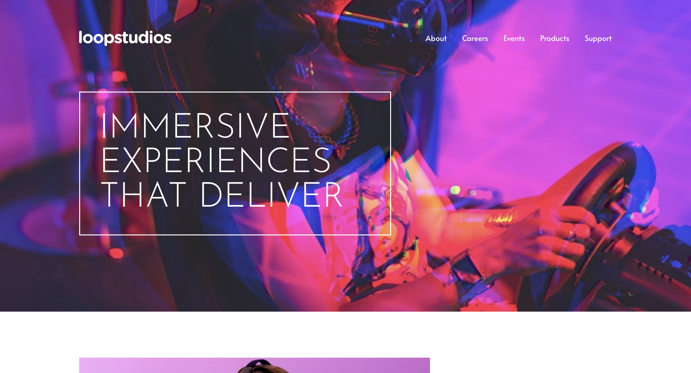

# Frontend Mentor - Loopstudios landing page solution

This is a solution to the [Loopstudios landing page challenge on Frontend Mentor](https://www.frontendmentor.io/challenges/loopstudios-landing-page-N88J5Onjw). Frontend Mentor challenges help you improve your coding skills by building realistic projects.

## Table of contents

-   [Overview](#overview)
    -   [The challenge](#the-challenge)
    -   [Screenshot](#screenshot)
    -   [Links](#links)
-   [My process](#my-process)
    -   [Built with](#built-with)
    -   [What I learned](#what-i-learned)
    -   [Useful resources](#useful-resources)
-   [Author](#author)

## Overview

### The challenge

Users should be able to:

-   View the optimal layout for the site depending on their device's screen size
-   See hover states for all interactive elements on the page

### Screenshot



### Links

-   Solution URL: [https://github.com/Joshk7/loopstudios](https://github.com/Joshk7/loopstudios)
-   Live Site URL: [https://loopstudios-eight-pi.vercel.app/](https://loopstudios-eight-pi.vercel.app/)

## My process

### Built with

-   Semantic HTML5 markup
-   CSS custom properties
-   Flexbox
-   CSS Grid
-   Mobile-first workflow
-   Sass
-   BEM

### What I learned

I wanted to learn how to combine Sass and less into one project to see how I'd develop a website using both. It took some initial work to setup the sass folder and proper importing and exporting of files, but once all that was handled, I enjoyed it. I especially liked being able to define a function that takes pixels and converts them to a respective proportion in rems:

```css
@use "sass:math";

@function rem($pixel) {
    @if math.is-unitless($pixel) {
        @return math.div($pixel, 16) + rem;
    } @else {
        @error 'Don\'t use units when using the rem function. Only numbers.';
    }
}

@function em($pixel) {
    @if math.is-unitless($pixel) {
        @return math.div($pixel, 16) + em;
    } @else {
        @error 'Don\'t use units when using the em function. Only numbers.';
    }
}
```

### Useful resources

-   [Sass Tutorial](https://www.youtube.com/watch?v=jfMHA8SqUL4) - This full Sass tutorial is where I got the function to convert pixels to rems and I'd recommend it for anyone trying to learn Sass.

## Author

-   Website - [Josh Kahlbaugh](https://joshuakahlbaugh.pages.dev/)
-   Frontend Mentor - [@Joshk7](https://www.frontendmentor.io/profile/Joshk7)
